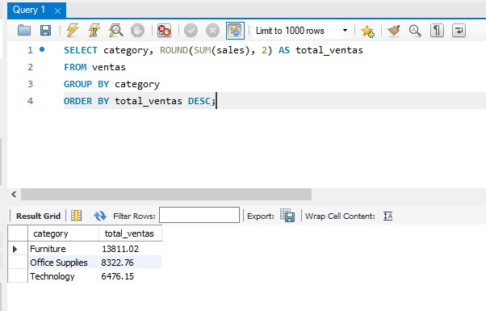
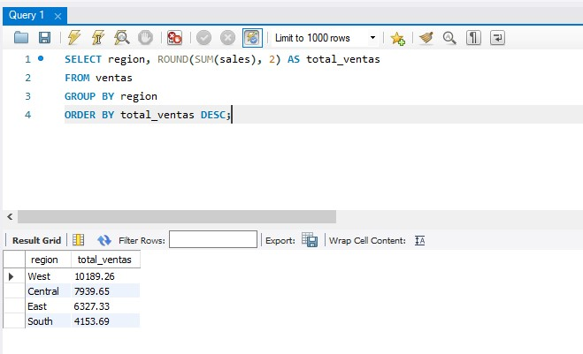
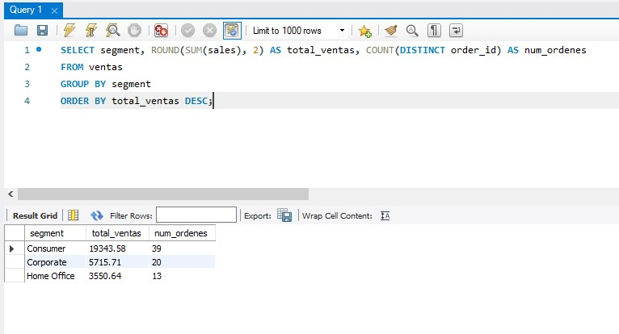
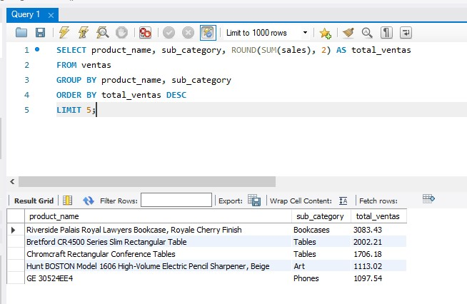
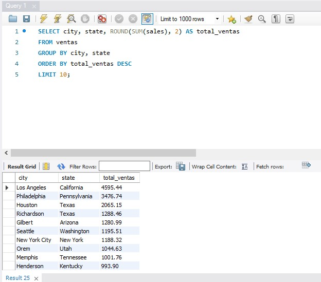
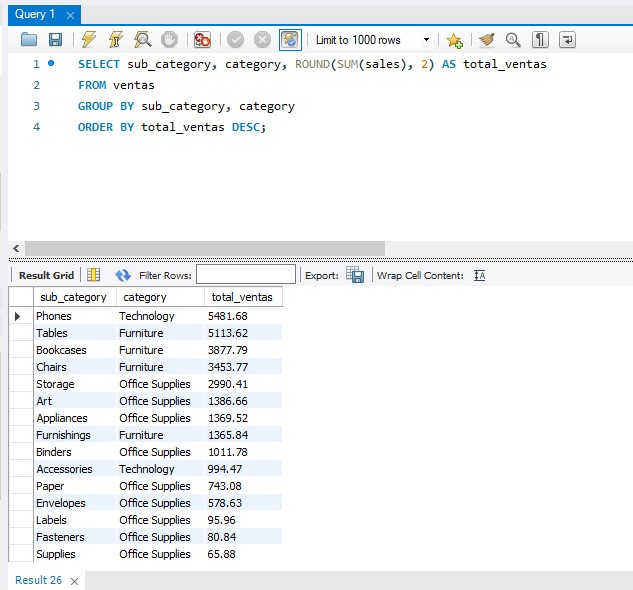
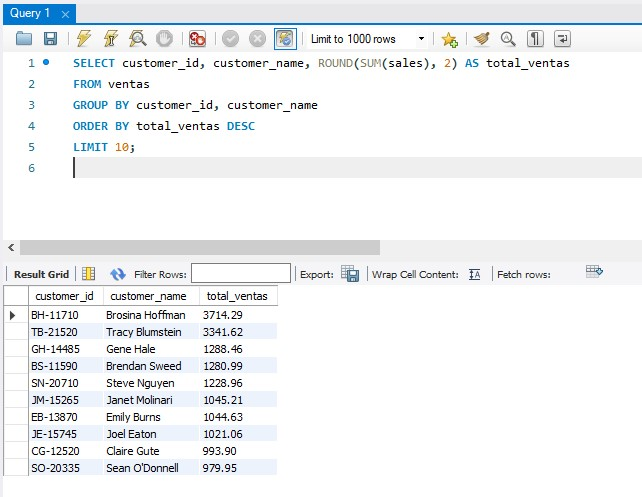
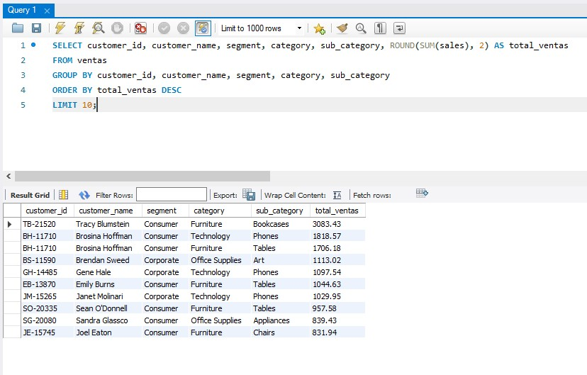

# Data_Analysis_Portfolio
Sales Analysis: Superstore Dataset
Este proyecto consiste en un análisis detallado del desempeño de ventas de la 'Superstore Dataset', una base de datos orientada al sector minorista. El objetivo principal es transformar datos brutos en inteligencia de negocio procesable mediante consultas SQL estructuradas.

A través de este análisis, busco identificar patrones de consumo, evaluar el rendimiento por regiones y segmentos de clientes, y detectar oportunidades de optimización en la distribución. Este informe documenta el proceso completo: desde la ingesta y modelado de datos en MySQL, hasta la extracción de insights clave que permiten una toma de decisiones informada y estratégica.

## Tecnologías Utilizadas
- **SQL (MySQL)**
- **MySQL Workbench**
- **Markdown**

## Análisis y Resultados

### 1.¿Cuál es la categoría de productos con más ventas?
Ventas totales por categoría:

R/ La categoria con mas ventas es la de Furniture con un total_ventas de 13811.02

### 2.¿Qué región vende más?
Se seleccionan todas las regiones de la tabla y en base a las ventas se categorizan de mayor a menor (DESC):

R/ La region con mas ventas es la West con un total_ventas de 10189.26 y una cantidad de 48 ventas sacadas con el COUNT(sales).

### 3.¿Qué segmento de clientes genera más ventas?

R/ El segment que mas ventas genero es el de Consumer con total_ventas de 19343.58 y una cantidad de num_ordenes (cada una con distinto order_id) de 39. Se evidencia que los Consumer son los que mas generan mas en sales al negocio

### 4.¿Cuáles son los 5 productos más vendidos?

Se consulta los 5 productos mas vendidos con su subcategoria:

R/ Los 5 productos mas vendidos
#1) Riverside Palais Royal Lawyers Bookcase, Royale Cherry Finish: total_ventas = 3083.43
#2) Bretford CR4500 Series Slim Rectangular Table: total_ventas = 2002.21
#3) Chromcraft Rectangular Conference Tables: total_ventas = 1706.18
#4) Hunt BOSTON Model 1606 High-Volume Electric Pencil Sharpener, Beige: total_ventas = 1113.02
#5) GE 30524EE4: total_ventas = 1097.54

### 5.¿Qué ciudad tiene más ventas? Y muestra el top 10.

R/ La ciudad que mas vende es la de Los Angeles del state California con un total_ventas de 4595.44
TOP 10: DESC
Los Angeles California 4595.44
Philadelphia Pennsylvania 3476.74
Houston Texas 2065.15
Richardson Texas 1288.46
Gilbert Arizona 1280.99
Seattle Washington 1195.51
New York City New York 1188.32
Orem Utah 1044.63
Memphis Tennessee	1001.76
Henderson Kentucky 993.90

### 6.¿Cual  es la sub-category con más ventas? 

Lo que mas compra la gente:

R/ La sub_category con mas ventas es Phones de la category Technology con un total_ventas de 5481.68.

### 7.¿Cuales son los 10 customer_id que mas generaron en sales?

### 8.¿Cuales son las 10 ventas mas caras realizadas por los customer_id, con sus customer_name, segment, category & sub_category:

*Documentado por: [Stevenson Junior Sarmiento Orozco]*

